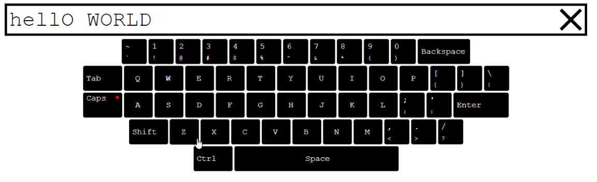

> <font size="2">**Some Person**, Phone: (555)-444-2222, Email: some@gmail.com</font>

<style>
    table td:first-of-type(1) {
        width: 60%;
    }
    
    table td:nth-of-type(2) {
        width: 45%;
        vertical-align: bottom;
    }
</style>

<table>
    <thead>
        <tr>
            <th>
                <font size="6">Some Person</font>
            </th>
            <th>
                <font size="6" color="gray">BACK-END DEVELOPER</font>
            </th>
        </tr>
    </thead>
    <tr>
        <td>
            <font size="3">Inventive Back End Developer with 12+ years of broad expertise in .NET/.NET CORE & WEB, JavaScript/ES6/ES2017 areas with willingness to learn and master Back-end Development and Web Servers Administration. Testing, DDD/TDD expert.</font>
        </td>
        <td>
            <ul>
                <li>
                <b>Phone: </b>(444)-555-4444
                </li>
                <li>
                <b>Email: </b>some@gmail.com
                </li>
                <li>
                <b>Telegram: </b>@anonymous
                </li>
                <li>
                <b>GitHub:</b><a href="https://github.comrsodst">@rsodst</a>
                </li>
            </ul>
        </td>
    </tr>
</table>

KEY SKILLS 
---

<table>
    <thead>
        <tr>
            <th>
                Back End
            </th>
            <th>
                Front End
            </th>
            <th>
                Testing
            </th>
        </tr>
    </thead>
    <tr>
        <td>
            <ul>
                <li>.NET/NET CORE</li>
                <li>C# 7.0, CLR/CLS,BCL</li>
                <li>Rest API, GraphQL,</li>
                <li>EF,EF Core ORM</li>
                <li>XML (XSLT,XPATH), JSON</li>
            </ul>
        </td>
        <td>
            <ul>
                <li> ASP.NET MVC, Blazor, Angular</li>
                <li> JavaScript, ES6, TypeScript </li>
                <li> HTML/CSS, scss</li>
                <li> npm</li>
            </ul>
        </td>
         <td>
            <ul>
                <li> NUnit, XUnit</li>
                <li> Unit Tests, TDD</li>
            </ul>
        </td>
    </tr>
    <thead>
        <tr>
            <th>
                Database
            </th>
            <th>
                Dev Ops
            </th>
             <th>
                SDLC
            </th>
        </tr>
    </thead>
    <tr>
        <td>
            <ul>
                <li> MS SQL Server</li>
                <li> PostgreeSql, Sqlite</li>
                <li> Elastic,Elastic.Net </li>
            </ul>
        </td>
        <td>
            <ul>
                <li> Docker </li>
                <li> GitHub, GitLab </li>
                <li> Base linux/windows</li>
            </ul>
        </td>
         <td>
            <ul>
                <li>Agile</li>
                <li>Confluence, GoF, Design Patterns</li>
                <li>Jira, SOLID, KISS</li>
                <li>TFS, Redmine</li>
            </ul>
        </td>
    </tr>
</table>

WORK HISTORY 
---

<table>
    <tr>
        <td>
            <p>Backend Developer</p>
            <ul>
                <li>Maintenance and developing backend application, writing business logic.</li>
                <li>Integration with external services (offline analytics, payment gates), develop subsystems.</li>
            </ul>
        </td>
        <td>
            <p>****** (Ufa)</p>
            <ul>
                <li>ASP.NET,NET.CORE</li>
                <li>Elastic/Elastic.NET</li>
                <li>MSSQL</li>
                <li>SOLID,DDD</li>
                <li>Microservices approach</li>
                <li>Message bus, rest</li>
            </ul>
        </td>
        <td>(01/2017 - Current time)</td>
    </tr>
    <tr>
        <td>
            <p>Software Engineer</p>
            <ul>
                <li>Develop software for remote control and administration technical system for virtual reality attraction.</li>
                <li>Develop game assets for rat server integration</li>
                <li>Develop mobile client for remote control</li>
            </ul>
        </td>
        <td>
            <p>****** (Ufa) </p>
            <ul>
                <li>C#/Unity3d</li>
                <li>powershell,WinApi</li>
            </ul>
        </td>
        <td>(09/2015 - 10/2016) </td>
    </tr>
    <tr>
        <td>
            <p>Intern software engineer</p>
            <ul>
                <li>I got into the cluster while studying at college. Development software for virtual reality systems (c# logic for unity3d).</li>
                <li>Integration several modules (kinect avatar,etc) with current systems.</li>
                <li>With completed software we wined the Imagine Cup 2014</li>
            </ul>
        </td>
        <td>
            <p>****** (Ufa) </p>
            <ul>
                <li>C++,C#</li>
                <li>WinForms, Sockets, WinApi</li>
                <li>Unity3d, VR/AR</li>
            </ul>
        </td>
        <td>(11/2013 - 08/2014)</td>
    </tr>
</table>

SIDE PROJECT 
--- 
.NET Raycast Engine 
> This is a simple project which raycast rendering. 
> I developed this just for fun. 
> I developed concrete simple game like a return to castle wolfenstein. 
> In this game player can moving into four side, fire for
enemy and open doors 


 JS Virtual Keyboard 
 > This is virtual keyboard that can handle input directly with mouse and keyboard Keyboard can handle additional keys with (shift/caps) mode 
 > Keyboard support color indications for press/unpress keys > Keyboard support language layout 
 
 
 CodeWars, Project Euler, LeetCode 
 > I like solve tasks from codewars, example code's below. 
 > Brifing : Write a function that accepts a square matrix (N x N 2D array) and returns the determinant of the matrix. 
 
 ```
function determinant(matrix) {
    if (matrix.length === 1) {
        return matrix[0][0];
    }

    if (matrix.length === 2) {
        return matrix[0][0] * matrix[1][1] - matrix[0][1] * matrix[1][0];
    }

    function getMinor(pos) {
        let minor = [matrix.length - 1];
        let a = 0;

        for (let i = 0; i < matrix.length; ++i) {
            if (i !== pos) {
                minor[a] = [];

                for (let j = 1; j < matrix.length; ++j) {
                    minor[a][j - 1] = matrix[j][i];
                }

                ++a;
            }
        }

        return minor;
    }

    let result = 0;

    for (let i = 0; i < matrix.length; ++i) {
        result += matrix[0][i] * (i % 2 === 0 ? 1 : -1) * determinant(getMinor(i));
    }

    return result;
} 
``` 
    
EDUCATION
--- 
* Ufa State Aviation College (2012-2016) 
* Ufa State Aviation Technical University (2016-2021) 
ADDITIONAL INFORMATION 
--- 
* Russian Language - native, English -A1 
* Not ready for relocation 
* I am self-organized and very motivated to become a fullstack developer. I learn JS,TS and also doing tasks on codewars everyday. I’m ver interested in this course and
job in future. 
* I known the Basic Computer Science, algorithms and data structures, went the course of web application development, i also learn JS on learn.javascript and do tasks on codewars. 
* My wishes is learn Core JS and upgrade my knowledge and be better in front-end